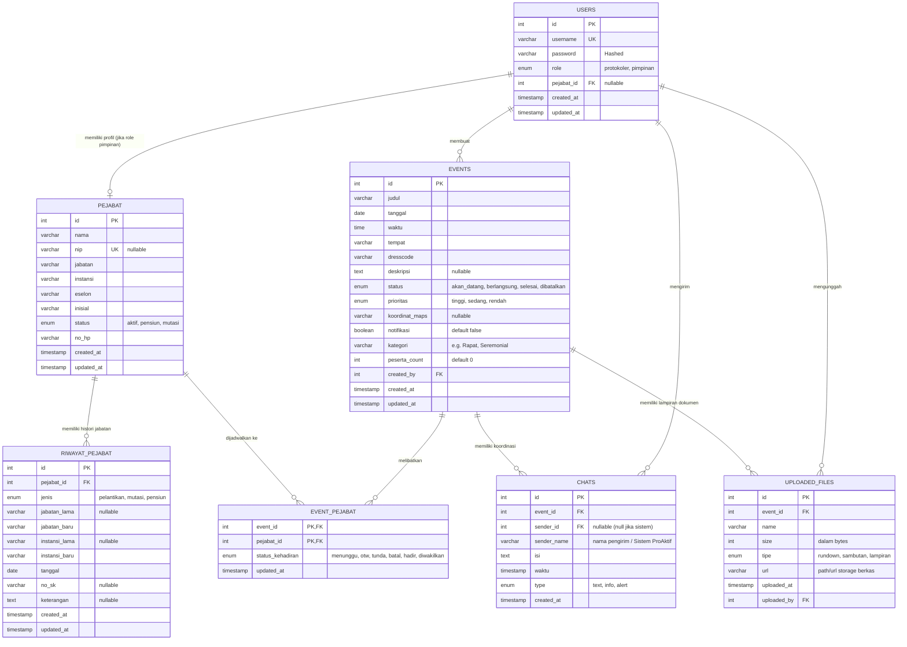

# ProAktif — Sistem Informasi Manajemen Protokoler & Pimpinan Provinsi Banten

**ProAktif** adalah aplikasi mockup UI/UX premium yang dirancang untuk menyederhanakan proses pengelolaan protokoler dan koordinasi pimpinan di lingkungan **Pemerintah Provinsi Banten**. Aplikasi ini menggunakan skema warna resmi institusi, kontras tinggi, tata letak intuitif, serta ramah bagi berbagai kalangan usia (termasuk pimpinan senior).

---

## 🚀 Cara Menjalankan Proyek secara Lokal

Ikuti langkah-langkah di bawah ini untuk mengkloning dan menjalankan aplikasi di komputer Anda:

### 1. Prasyarat (Prerequisites)
Pastikan Anda sudah menginstal perangkat lunak berikut:
* **Node.js** (Versi 18 ke atas direkomendasikan)
* **npm** (biasanya otomatis terinstal bersama Node.js) atau **pnpm**

---

### 2. Kloning Repositori
Jalankan perintah berikut di terminal/command prompt Anda untuk mengunduh repositori ini:
```bash
git clone https://github.com/IntellQueue/Mockup-UI-UX-ProAktif.git
cd Mockup-UI-UX-ProAktif
```

---

### 3. Instalasi Dependensi
Instal semua modul/dependensi yang diperlukan dengan menjalankan:
```bash
npm install
```
*(Catatan: Jika Anda menggunakan pnpm, Anda bisa menjalankan `pnpm install`)*

---

### 4. Jalankan Aplikasi
Setelah dependensi berhasil diinstal, jalankan server pengembangan lokal:
```bash
npm run dev
```

Server akan aktif, biasanya di alamat:
👉 **[http://localhost:5173/](http://localhost:5173/)**

Buka tautan tersebut di peramban (browser) pilihan Anda.

---

## 🔑 Kredensial Akun Uji Coba (Demo Login)

Aplikasi ini menyediakan dua peran (role) dengan tampilan antarmuka yang disesuaikan secara dinamis:

| Peran (Role) | NIP / Username | Kata Sandi (Password) | Deskripsi Fitur |
| :--- | :--- | :--- | :--- |
| **🛡 Protokoler** | `protokol` | `admin123` | Panel operator untuk membuat agenda baru, mengelola struktur data pejabat, mengunggah dokumen (Rundown, Sambutan, Lampiran), dan mengirimkan koordinasi chat. |
| **👤 Pimpinan** | `gubernur` | `pimpinan` | Panel pimpinan (Gubernur/Wagub) untuk memantau agenda hari ini secara real-time, memperbarui status kehadiran (OTW, TUNDA, BATAL), melihat berkas resmi, dan berkoordinasi via grup chat acara. |

---

## 📁 Struktur Folder Utama

* `src/app/App.tsx` - Komponen utama yang berisi logika aplikasi, simulasi data (seed data), sistem otentikasi login, serta tata letak dashboard protokoler dan pimpinan.
* `src/app/components/ui/` - Komponen UI reusable berbasis standard Tailwind CSS dan Shadcn.
* `src/styles/` - Berkas konfigurasi styling global dan tema khusus bernuansa hijau kehutanan/emas khas Provinsi Banten.
* `src/imports/` - Berisi aset visual berupa diagram alur protokoler dan screenshot mockup.

---

## 🛠 Teknologi yang Digunakan

* **Framework Core**: React.js & TypeScript
* **Styling**: Tailwind CSS v4 & Lucide React (Icons)
* **Build Tool**: Vite.js
* **Animasi**: Framer Motion / Motion.dev

---

## 🧪 Skenario Alur Uji Coba (Mockup Testing Flow)

Berikut adalah panduan langkah demi langkah untuk menguji fitur utama UI/UX ProAktif secara interaktif:

### 1. Uji Coba Sinkronisasi Chat Real-time (Protokoler ↔️ Pimpinan)
* **Langkah 1**: Buka dua jendela browser berdampingan (atau gunakan mode Penyamaran/Incognito untuk salah satunya).
* **Langkah 2**: Pada Jendela 1, login sebagai **Protokoler** (`protokol` / `admin123`). Masuk ke menu **Agenda & Kegiatan**, lalu klik ikon chat (Grup Chat Acara) pada agenda pertama.
* **Langkah 3**: Pada Jendela 2, login sebagai **Pimpinan** (`gubernur` / `pimpinan`). Expand kartu agenda pertama dan lihat bagian **Grup Chat Acara**.
* **Langkah 4**: Ketik pesan dari sisi Protokoler dan kirim. Lihat bagaimana pesan langsung muncul di sisi Pimpinan secara real-time.
* **Langkah 5**: Lakukan sebaliknya (kirim pesan dari Pimpinan) untuk melihat respons balik.
* **Langkah 6** (*Auto-Scroll Check*): Ketik pesan yang cukup panjang hingga scrollbar muncul. Kirim pesan baru, dan pastikan layar otomatis bergeser ke pesan terbaru (*scroll to bottom*). Layar tidak akan melompat secara tiba-tiba jika pesan dikirim dari akun lain.

### 2. Uji Coba Perubahan Status Agenda Otomatis
* **Langkah 1**: Login sebagai **Protokoler**. Masuk ke halaman **Agenda & Kegiatan** lalu klik **+ Tambah Agenda**.
* **Langkah 2**: Isi judul agenda baru bebas, pilih tanggal **Hari Ini**, dan atur waktu mulai **1 menit dari waktu Anda sekarang** (misal jika saat ini pukul 21:58, atur ke pukul 21:59).
* **Langkah 3**: Simpan agenda tersebut. Agenda baru akan berstatus **Akan Datang**.
* **Langkah 4**: Buka grup chat agenda tersebut dan tunggu hingga waktu komputer Anda memasuki menit tersebut.
* **Langkah 5**: Sistem otomatis mengubah status agenda tersebut menjadi **Berlangsung**, memindahkan tab filternya, dan memicu pesan info sistem di grup chat: *"⚡ Waktu agenda telah masuk. Status otomatis diubah menjadi BERLANGSUNG."*

### 3. Uji Coba Interaktivitas Profil Pejabat & Sirine Mitigasi
* **Langkah 1**: Login sebagai **Protokoler**. Di halaman Dasbor, Anda akan melihat alert darurat berwarna merah karena ada pimpinan yang belum respons untuk agenda yang segera dimulai.
* **Langkah 2**: Klik badge status pimpinan (misalnya nama gubernur/wagub) yang ada di dalam kartu agenda darurat atau agenda reguler.
* **Langkah 3**: Modal **Detail Profil Pejabat** akan terbuka menampilkan NIP, pangkat, no HP, serta riwayat mutasi/pelantikan.
* **Langkah 4**: Klik tombol **Hubungi WhatsApp** untuk mensimulasikan koordinasi langsung ke nomor WhatsApp pejabat tersebut.

### 4. Uji Coba Filter Status "Dibatalkan"
* **Langkah 1**: Login sebagai **Protokoler** lalu masuk ke **Agenda & Kegiatan**.
* **Langkah 2**: Edit salah satu agenda, ubah statusnya menjadi **Dibatalkan** di pilihan status formulir, lalu simpan.
* **Langkah 3**: Klik tab filter **Dibatalkan** pada navigasi bar atas untuk memastikan agenda yang baru saja dibatalkan terfilter dengan benar dan terpisah dari agenda aktif.

---
*ProAktif - Biro Administrasi Pimpinan Pemerintah Provinsi Banten.*

---

## 🗄️ Rancangan Database & Entity Relationship Diagram (ERD)

Jika aplikasi **ProAktif** dideploy menjadi aplikasi produksi yang nyata, kita memerlukan sistem manajemen database relasional (RDBMS) seperti **PostgreSQL** atau **MySQL/MariaDB**.

Berikut adalah rancangan skema database, tabel-tabel yang harus dibuat, serta **Entity Relationship Diagram (ERD)** untuk mendukung seluruh fitur ProAktif.

### 1. Entity Relationship Diagram (ERD)

Berikut adalah diagram relasi entitas menggunakan notasi **Mermaid.js** yang otomatis dirender oleh GitHub/Markdown viewer:



---

### 2. Spesifikasi Detail Tabel Database

#### A. Tabel `users`
Digunakan untuk menangani otentikasi login pengguna aplikasi (baik staff protokoler maupun pimpinan).
*   `pejabat_id` bernilai `NULL` jika role-nya adalah `protokoler`, dan bernilai `FOREIGN KEY` ke tabel `pejabat` jika role-nya adalah `pimpinan`.

| Nama Kolom | Tipe Data | Atribut | Deskripsi |
| :--- | :--- | :--- | :--- |
| **id** | INT | PK, AUTO_INCREMENT | ID unik pengguna |
| **username** | VARCHAR(50) | UNIQUE, NOT NULL | Username login (misal: `protokol`, `gubernur`, atau NIP) |
| **password** | VARCHAR(255) | NOT NULL | Password terenkripsi (bcrypt/argon2) |
| **role** | ENUM | NOT NULL | Pilihan role: `'protokoler'` atau `'pimpinan'` |
| **pejabat_id** | INT | FK, NULLABLE | Relasi ke tabel `pejabat` jika user adalah pimpinan |
| **created_at** | TIMESTAMP | DEFAULT CURRENT_TIMESTAMP | Waktu pendaftaran |
| **updated_at** | TIMESTAMP | NULLABLE | Waktu perubahan data terakhir |

#### B. Tabel `pejabat`
Menyimpan profil pimpinan dan pejabat di lingkungan Pemerintah Provinsi Banten.
*   `nip` dibuat `NULLABLE` karena pejabat politik seperti Gubernur/Wakil Gubernur tidak memiliki NIP PNS standar.

| Nama Kolom | Tipe Data | Atribut | Deskripsi |
| :--- | :--- | :--- | :--- |
| **id** | INT | PK, AUTO_INCREMENT | ID unik pejabat |
| **nama** | VARCHAR(150) | NOT NULL | Nama lengkap pejabat beserta gelar akademis/adat |
| **nip** | VARCHAR(30) | UNIQUE, NULLABLE | Nomor Induk Pegawai (jika ASN) |
| **jabatan** | VARCHAR(100) | NOT NULL | Jabatan struktural/politik saat ini |
| **instansi** | VARCHAR(150) | NOT NULL | Instansi penempatan |
| **eselon** | VARCHAR(50) | NOT NULL | Tingkatan eselon (e.g. `Eselon I-A`, `Jabatan Politik`) |
| **inisial** | VARCHAR(5) | NOT NULL | Singkatan nama inisial (e.g. `RK`, `RU`, `SW`) |
| **status** | ENUM | NOT NULL | Status kepegawaian: `'aktif'`, `'pensiun'`, atau `'mutasi'` |
| **no_hp** | VARCHAR(20) | NOT NULL | Nomor telepon/WhatsApp aktif (untuk integrasi WA Gateway) |
| **created_at** | TIMESTAMP | DEFAULT CURRENT_TIMESTAMP | Log pendaftaran pejabat |
| **updated_at** | TIMESTAMP | NULLABLE | Log update profil |

#### C. Tabel `riwayat_pejabat`
Menyimpan histori mutasi, pelantikan, atau masa pensiun pejabat untuk kebutuhan audit dan arsip kepegawaian Biro Administrasi Pimpinan.

| Nama Kolom | Tipe Data | Atribut | Deskripsi |
| :--- | :--- | :--- | :--- |
| **id** | INT | PK, AUTO_INCREMENT | ID unik riwayat |
| **pejabat_id** | INT | FK, NOT NULL | Relasi ke tabel `pejabat` (Cascade Delete) |
| **jenis** | ENUM | NOT NULL | Jenis aktivitas: `'pelantikan'`, `'mutasi'`, atau `'pensiun'` |
| **jabatan_lama** | VARCHAR(100) | NULLABLE | Jabatan sebelum mutasi/pelantikan |
| **jabatan_baru** | VARCHAR(100) | NOT NULL | Jabatan sesudah mutasi/pelantikan |
| **instansi_lama** | VARCHAR(150) | NULLABLE | Instansi sebelum mutasi/pelantikan |
| **instansi_baru** | VARCHAR(150) | NOT NULL | Instansi sesudah mutasi/pelantikan |
| **tanggal** | DATE | NOT NULL | Tanggal SK atau berlakunya jabatan |
| **no_sk** | VARCHAR(100) | NULLABLE | Nomor Surat Keputusan (SK) resmi |
| **keterangan** | TEXT | NULLABLE | Catatan tambahan atau penjelasan agenda pelantikan |
| **created_at** | TIMESTAMP | DEFAULT CURRENT_TIMESTAMP | Log sistem dibuat |
| **updated_at** | TIMESTAMP | NULLABLE | Log sistem diperbarui |

#### D. Tabel `events`
Menyimpan data inti agenda acara pemerintahan.
*   `created_by` melacak staff protokoler mana yang menginput agenda ke sistem.

| Nama Kolom | Tipe Data | Atribut | Deskripsi |
| :--- | :--- | :--- | :--- |
| **id** | INT | PK, AUTO_INCREMENT | ID unik kegiatan |
| **judul** | VARCHAR(255) | NOT NULL | Nama agenda acara |
| **tanggal** | DATE | NOT NULL | Hari pelaksanaan kegiatan |
| **waktu** | TIME | NOT NULL | Jam pelaksanaan (Format: HH:MM) |
| **tempat** | VARCHAR(255) | NOT NULL | Lokasi detail acara |
| **dresscode** | VARCHAR(255) | NOT NULL | Pakaian dinas/bebas yang ditentukan protokoler |
| **deskripsi** | TEXT | NULLABLE | Deskripsi detail atau poin-poin penting acara |
| **status** | ENUM | NOT NULL | Status agenda: `'akan_datang'`, `'berlangsung'`, `'selesai'`, `'dibatalkan'` |
| **prioritas** | ENUM | NOT NULL | Tingkat urgensi: `'tinggi'`, `'sedang'`, `'rendah'` |
| **koordinat_maps**| VARCHAR(100) | NULLABLE | Koordinat peta (Lat, Long) untuk navigasi pimpinan |
| **notifikasi** | BOOLEAN | DEFAULT FALSE | Pengiriman notifikasi otomatis aktif (WA Gateway/Push) |
| **kategori** | VARCHAR(50) | NOT NULL | Kategori agenda (e.g. `'Seremonial'`, `'Rapat'`, `'Audiensi'`) |
| **peserta_count** | INT | DEFAULT 0 | Estimasi jumlah massa/undangan yang hadir |
| **created_by** | INT | FK, NOT NULL | Relasi ke tabel `users` (Pembuat agenda) |
| **created_at** | TIMESTAMP | DEFAULT CURRENT_TIMESTAMP | Tanggal agenda diinput |
| **updated_at** | TIMESTAMP | NULLABLE | Tanggal agenda dimodifikasi |

#### E. Tabel `event_pejabat` (Tabel Pivot Many-to-Many)
Tabel ini memetakan pejabat mana saja yang didelegasikan/ditag ke suatu agenda kegiatan tertentu, sekaligus melacak status kehadiran real-time masing-masing pimpinan.

| Nama Kolom | Tipe Data | Atribut | Deskripsi |
| :--- | :--- | :--- | :--- |
| **event_id** | INT | PK, FK, NOT NULL | Relasi ke tabel `events` (Cascade Delete) |
| **pejabat_id** | INT | PK, FK, NOT NULL | Relasi ke tabel `pejabat` (Cascade Delete) |
| **status_kehadiran**| ENUM | DEFAULT 'menunggu' | Status per pejabat: `'menunggu'`, `'otw'`, `'tunda'`, `'batal'`, `'hadir'`, `'diwakilkan'` |
| **updated_at** | TIMESTAMP | DEFAULT CURRENT_TIMESTAMP | Log terakhir pimpinan mengubah status kehadirannya |

#### F. Tabel `uploaded_files`
Menyimpan informasi meta-data file atau berkas resmi yang diunggah ke suatu kegiatan (seperti PDF Rundown, naskah Sambutan, atau berkas Lampiran). File fisiknya sendiri disimpan di Cloud Storage (seperti AWS S3, Google Cloud Storage, atau MinIO).

| Nama Kolom | Tipe Data | Atribut | Deskripsi |
| :--- | :--- | :--- | :--- |
| **id** | INT | PK, AUTO_INCREMENT | ID dokumen |
| **event_id** | INT | FK, NOT NULL | Relasi ke tabel `events` (Cascade Delete) |
| **name** | VARCHAR(255) | NOT NULL | Nama asli file pendukung |
| **size** | INT | NOT NULL | Ukuran file dalam satuan Byte |
| **tipe** | ENUM | NOT NULL | Kategori berkas: `'rundown'`, `'sambutan'`, atau `'lampiran'` |
| **url** | VARCHAR(2083) | NOT NULL | Path/URL akses unduh file di cloud storage |
| **uploaded_at** | TIMESTAMP | DEFAULT CURRENT_TIMESTAMP | Waktu file diunggah |
| **uploaded_by** | INT | FK, NOT NULL | Relasi ke tabel `users` (Staff pengunggah berkas) |

#### G. Tabel `chats`
Menyimpan riwayat pesan obrolan grup koordinasi internal untuk masing-masing agenda kegiatan.
*   Jika `sender_id` bernilai `NULL`, berarti pesan dikirim oleh sistem otomatis (system logs / alert mitigasi).

| Nama Kolom | Tipe Data | Atribut | Deskripsi |
| :--- | :--- | :--- | :--- |
| **id** | INT | PK, AUTO_INCREMENT | ID pesan |
| **event_id** | INT | FK, NOT NULL | Relasi ke tabel `events` (Cascade Delete) |
| **sender_id** | INT | FK, NULLABLE | Relasi ke tabel `users` (Pengirim pesan, NULL jika bot sistem) |
| **sender_name** | VARCHAR(150) | NOT NULL | Nama display pengirim (misal: `"Ahmad Fauzi (Protokol)"` atau `"Sistem ProAktif"`) |
| **isi** | TEXT | NOT NULL | Konten pesan obrolan |
| **waktu** | TIMESTAMP | DEFAULT CURRENT_TIMESTAMP | Waktu spesifik pengiriman pesan |
| **type** | ENUM | DEFAULT 'text' | Tipe tampilan pesan: `'text'`, `'info'`, atau `'alert'` |
| **created_at** | TIMESTAMP | DEFAULT CURRENT_TIMESTAMP | Waktu simpan di database |

---

### 3. Script SQL DDL (Skema Pembuatan Tabel)

<details>
<summary>📂 Klik untuk melihat script SQL CREATE TABLE (DDL)</summary>

```sql
-- Membuat tabel pejabat terlebih dahulu karena direferensikan oleh tabel lain
CREATE TABLE pejabat (
    id INT AUTO_INCREMENT PRIMARY KEY,
    nama VARCHAR(150) NOT NULL,
    nip VARCHAR(30) UNIQUE NULL,
    jabatan VARCHAR(100) NOT NULL,
    instansi VARCHAR(150) NOT NULL,
    eselon VARCHAR(50) NOT NULL,
    inisial VARCHAR(5) NOT NULL,
    status ENUM('aktif', 'pensiun', 'mutasi') NOT NULL DEFAULT 'aktif',
    no_hp VARCHAR(20) NOT NULL,
    created_at TIMESTAMP DEFAULT CURRENT_TIMESTAMP,
    updated_at TIMESTAMP NULL ON UPDATE CURRENT_TIMESTAMP
);

-- Membuat tabel users untuk otentikasi login (protokoler & pimpinan)
CREATE TABLE users (
    id INT AUTO_INCREMENT PRIMARY KEY,
    username VARCHAR(50) UNIQUE NOT NULL,
    password VARCHAR(255) NOT NULL,
    role ENUM('protokoler', 'pimpinan') NOT NULL,
    pejabat_id INT NULL,
    created_at TIMESTAMP DEFAULT CURRENT_TIMESTAMP,
    updated_at TIMESTAMP NULL ON UPDATE CURRENT_TIMESTAMP,
    FOREIGN KEY (pejabat_id) REFERENCES pejabat(id) ON DELETE SET NULL
);

-- Membuat tabel riwayat karir pejabat
CREATE TABLE riwayat_pejabat (
    id INT AUTO_INCREMENT PRIMARY KEY,
    pejabat_id INT NOT NULL,
    jenis ENUM('pelantikan', 'mutasi', 'pensiun') NOT NULL,
    jabatan_lama VARCHAR(100) NULL,
    jabatan_baru VARCHAR(100) NOT NULL,
    instansi_lama VARCHAR(150) NULL,
    instansi_baru VARCHAR(150) NOT NULL,
    tanggal DATE NOT NULL,
    no_sk VARCHAR(100) NULL,
    keterangan TEXT NULL,
    created_at TIMESTAMP DEFAULT CURRENT_TIMESTAMP,
    updated_at TIMESTAMP NULL ON UPDATE CURRENT_TIMESTAMP,
    FOREIGN KEY (pejabat_id) REFERENCES pejabat(id) ON DELETE CASCADE
);

-- Membuat tabel agenda kegiatan
CREATE TABLE events (
    id INT AUTO_INCREMENT PRIMARY KEY,
    judul VARCHAR(255) NOT NULL,
    tanggal DATE NOT NULL,
    waktu TIME NOT NULL,
    tempat VARCHAR(255) NOT NULL,
    dresscode VARCHAR(255) NOT NULL,
    deskripsi TEXT NULL,
    status ENUM('akan_datang', 'berlangsung', 'selesai', 'dibatalkan') NOT NULL DEFAULT 'akan_datang',
    prioritas ENUM('tinggi', 'sedang', 'rendah') NOT NULL DEFAULT 'sedang',
    koordinat_maps VARCHAR(100) NULL,
    notifikasi BOOLEAN DEFAULT FALSE,
    kategori VARCHAR(50) NOT NULL,
    peserta_count INT DEFAULT 0,
    created_by INT NOT NULL,
    created_at TIMESTAMP DEFAULT CURRENT_TIMESTAMP,
    updated_at TIMESTAMP NULL ON UPDATE CURRENT_TIMESTAMP,
    FOREIGN KEY (created_by) REFERENCES users(id)
);

-- Tabel pivot Many-to-Many untuk relasi Event - Pejabat beserta status kehadiran
CREATE TABLE event_pejabat (
    event_id INT NOT NULL,
    pejabat_id INT NOT NULL,
    status_kehadiran ENUM('menunggu', 'otw', 'tunda', 'batal', 'hadir', 'diwakilkan') NOT NULL DEFAULT 'menunggu',
    updated_at TIMESTAMP DEFAULT CURRENT_TIMESTAMP ON UPDATE CURRENT_TIMESTAMP,
    PRIMARY KEY (event_id, pejabat_id),
    FOREIGN KEY (event_id) REFERENCES events(id) ON DELETE CASCADE,
    FOREIGN KEY (pejabat_id) REFERENCES pejabat(id) ON DELETE CASCADE
);

-- Tabel file/berkas resmi per agenda
CREATE TABLE uploaded_files (
    id INT AUTO_INCREMENT PRIMARY KEY,
    event_id INT NOT NULL,
    name VARCHAR(255) NOT NULL,
    size INT NOT NULL,
    tipe ENUM('rundown', 'sambutan', 'lampiran') NOT NULL,
    url VARCHAR(2083) NOT NULL,
    uploaded_at TIMESTAMP DEFAULT CURRENT_TIMESTAMP,
    uploaded_by INT NOT NULL,
    FOREIGN KEY (event_id) REFERENCES events(id) ON DELETE CASCADE,
    FOREIGN KEY (uploaded_by) REFERENCES users(id)
);

-- Tabel riwayat chat grup koordinasi acara
CREATE TABLE chats (
    id INT AUTO_INCREMENT PRIMARY KEY,
    event_id INT NOT NULL,
    sender_id INT NULL,
    sender_name VARCHAR(150) NOT NULL,
    isi TEXT NOT NULL,
    waktu TIMESTAMP DEFAULT CURRENT_TIMESTAMP,
    type ENUM('text', 'info', 'alert') NOT NULL DEFAULT 'text',
    created_at TIMESTAMP DEFAULT CURRENT_TIMESTAMP,
    FOREIGN KEY (event_id) REFERENCES events(id) ON DELETE CASCADE,
    FOREIGN KEY (sender_id) REFERENCES users(id) ON DELETE SET NULL
);
```
</details>

---

*ProAktif - Biro Administrasi Pimpinan Pemerintah Provinsi Banten.*